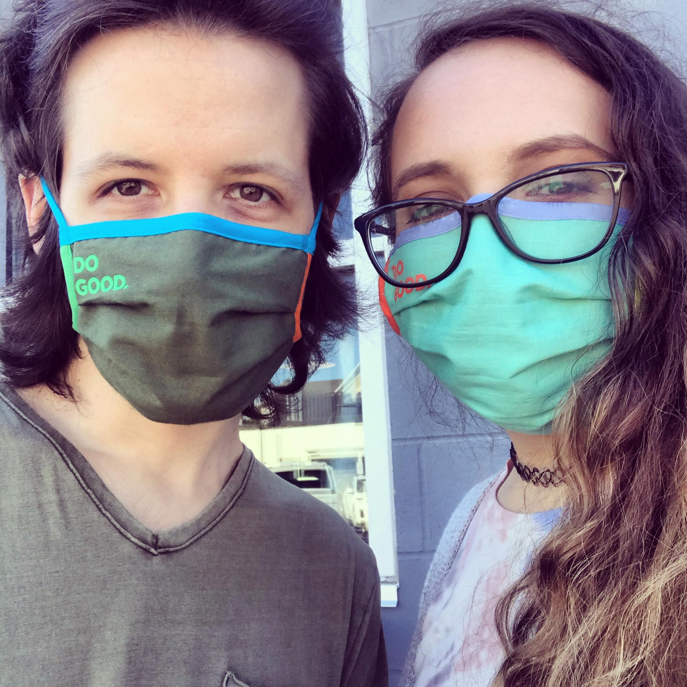

# About Us

### Hello friends, we are Kyle and Lexi!

<!-- Row Start -->
:::: {style="display: grid; grid-template-columns: 1fr 2fr; grid-column-gap: 10px;"}

<!-- Column 1 Start -->
::: {}

<!-- Column 1 End -->
:::

<!-- Column 2 Start -->
::: {}

A couple of [flexitarian](https://en.wikipedia.org/wiki/Semi-vegetarianism){target="_blank"} gamers from the Midwest trying to live sustainably, stay healthy, and help others. We started this blog to share all of the things we are passionate about, like vegan food, video games, sexual wellness, and more! We hope that by sharing a bit of our everyday life, we can encourage others to make more informed and healthy decisions, both for themselves and our planet.

<!-- Column 2 End -->
:::

<!-- Row End -->
::::

### More about Kyle:

:::: {style="display: grid; grid-template-columns: 1fr 2fr; grid-column-gap: 10px;"}

::: {}

:::

::: {}

A giant dummy that likes coding and who incidentally helped build the world’s largest calzone. Graduated with degrees in both Health Data Science and Informatics from IUPUI. Interested in machine learning, the coding language R, and open-source software. Enjoys working on new projects, One Piece, Limoncello LaCroix, and black coffee.

:::

::::

### More about Lexi:

:::: {style="display: grid; grid-template-columns: 1fr 2fr; grid-column-gap: 10px;"}

::: {}

:::

::: {}

An actual toilet that is bad at video games and coding but tries her best. Graduated with a degree in Community Health from IUPUI and is a Certified Health Education Specialist. Interested in sexual and mental health education, sustainability, and thrifting. Enjoys cooking, JJBA, playing Smite (feeding on Discordia every night), and a green tea latte. 

:::

::::