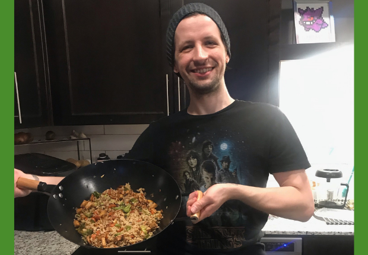

 

## Hello friends, this is how we make fried rice! c:

<!-- featured_image_preview is 780x234 -->

Amount of servings: 4

:::: {style="display: grid; grid-template-columns: 1fr 1fr; grid-column-gap: 10px;"}

::: {}

### <u>Ingredients</u>

#### Tofu Marinade:

- 1 tbsp soy sauce
- 1 tsp garlic powder
- .5 tsp cayenne pepper
- 1 pinch pepper

#### Everything Else:

- One block of firm or extra firm tofu
- 1 cup uncooked brown rice
- 1 head of broccoli
- 2 cups chopped carrots
- 1 medium onion or 2 small
- 2 cloves of garlic
- .5 lemon
- 2 tbsp soy sauce
- 1 pinch pepper
- 1 pinch ginger
- 2 tbsp vegan butter or oil

::: 

::: {}

### <u>Preparation</u> 

1. Press tofu and drain
2. Dice tofu into small cubes
3. Combine tofu marinade in a small bowl and stir in the tofu, allowing it to sit for at least 20 minutes
4. Turn on the instant pot, dump in the rice and one cup of water, and set to high pressure cook for 15 minutes, making sure you move the steam valve to closed.
5. As the rice cooks, heat up a large frying pan or wok to medium heat with 2 tbsp vegan butter
6. Dice onion and carrots and saute in heated pan until onions are translucent
7. Pre-heat the air fryer to 375°
8. Mince garlic cloves and add to the wok as the air-fryer pre-heats
9. Dump tofu into the now hot air-fryer and set to cook for 15 minutes
10. Chop broccoli into bite-sized pieces and add to the wok
11. Continue to stir and cook vegetables while rice and tofu cooks
12. Once the rice is cooked, allow it to sit and naturally release pressure for 5 minutes before turning the steam valve to open. Once the weight drops, the lid can be opened.
13. Add the cooked rice and tofu to wok
14. Finish with soy sauce, pepper, ginger, and lemon juice.
15. Give everything one final stir to combine and serve

:::

::::

 

---

### Notes:

- This can be made with any vegetables you have on hand especially the ones you need to get rid of
- If you have an instant pot you can use it to cook the rice quickly while you work over the wok, but [cooking it on the stove](https://www.loveandlemons.com/how-to-cook-brown-rice/#wprm-recipe-container-42121){target="_blank"} and allowing it to sit before starting the recipe will also work.
- Kyle and I buy a huge bag of carrots at Costco and chop it up all at once to store in the freezer. As we make meals like this one, we grab the already chopped frozen carrots and just throw them in the skillet, allowing the water to cook off them before adding the other vegetables 
- The tofu *can* be baked in the oven at **400° for 30 minutes**, but Kyle and I prefer to use our air-fryer to get it nice and crispy quickly
- Any vegan oil can be used to make this, but Kyle and I prefer to use a vegan butter such as [Myoko's](https://miyokos.com/collections/vegan-butter){target="_blank"} or [Earth Balance](https://earthbalancenatural.com/spreads/original-buttery-spread){target="_blank"}

 

 Kyle was very excited to show off the rice. We hope you enjoy! :) 
