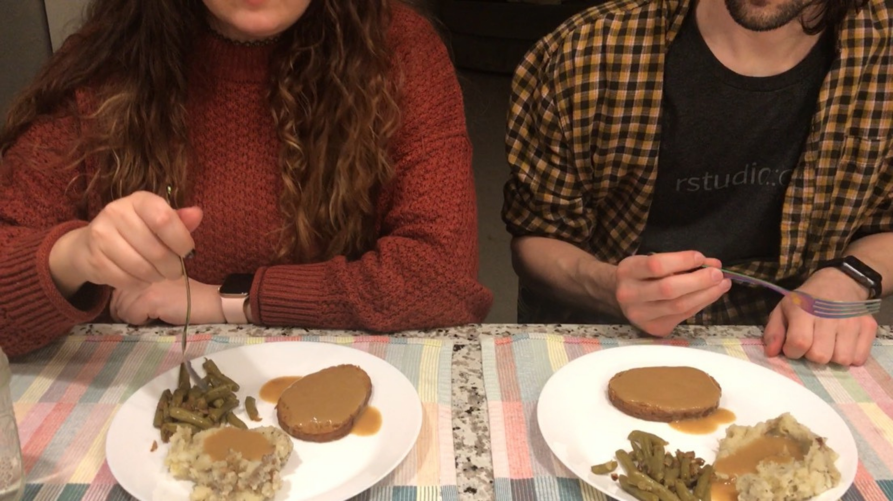

<br>

## Hello friends, this is what we ate for Thanksgiving this year!

<!-- featured_image_preview is 780x234 -->
<br>

```{r, echo=FALSE}
blogdown::shortcode("youtube", "")
```

<br>

Kyle and I decided we were going to challenge ourselves to stay safe at home and make our own vegan thanksgiving meal. We did not come up with any of the recipes that we used, but we did modify them, so I will link the recipes below, and also list exactly what we used and did to make all 3 recipes very easily. 

### We will also be streaming on Thanksgiving, making this exact recipe and sitting down to eat with our friends in chat



## We will be live starting at 6PM CST at [twitch.tv/koderkow](https://www.twitch.tv/koderkow){target="_blank"}

Come say hello and hang out with us or stop by and say hello in between your own festivities! :)

### Recipes:

- Amount of servings: 4
- [Field Roast Celebration Roast](http://fieldroast.com/recipe/celebration-roast-with-gravy-and-cumin-roasted-carrots/){target="_blank"}
- [Vegan Gravy](https://www.noracooks.com/easy-vegan-gravy/){target="_blank"}
- [Mashed Potatoes](https://www.budgetbytes.com/fluffy-garlic-herb-mashed-potatoes/){target="_blank"}
    - This recipe is not vegan, but it easily made vegan by replacing the milk and butter with vegan milk and butter

:::: {style="display: grid; grid-template-columns: 1fr 1fr; grid-column-gap: 10px;"}

::: {}

### <u>Ingredients</u>

#### Gravy

- 2.00 cups vegetable broth
- 0.75 tsp onion salt
- 3.00 tbsp nutritional yeast
- 1.00 tbsp soy sauce 
- 0.50 teaspoon mustard
- 0.25 cup all purpose flour

#### Roast

- 1.00 Field Roast Celebration Roast
- 1.00 tsp olive oil
- 5.00 tbsp vegetable broth

#### Mashed Potatoes

- 1.50 lbs of russet potatoes
- 3.00 tbsp vegan butter
- 2.50 ounces plant based milk
- 0.50 tsp garlic chives
- 0.50 tsp parsley
- 0.50 tsp oregano
- 0.50 tsp thyme
- 1.00 pinch salt
- 1.00 pinch black pepper

#### Green Beans

- 1.00 can of green beans
- 2.00 tbsp vegan butter
- 1.00 small onion
- 2.00 cloves of garlic
- 1.00 pinch of salt
- 1.00 pinch of pepper

::: 

::: {}

### <u>Preparation</u> 

1. Preheat the oven to 350° F
1. Start the pot for the gravy on medium heat and stir in all the ingredients
1. Wash and cube the potatoes, setting aside in a small bowl
1. Stir the gravy pot again and start another pot with enough water to cover the potatoes on medium heat
1. Take your thawed Celebration Roast, remove the packaging, and place it in a baking dish. Brush the roast with olive oil and pour some vegetable broth in the bottom of the dish. Cover with foil and place in the oven for 45 minutes
1. Finish gravy, set aside on trivet, and hang out for a few minutes while you wait to start the potatoes. We waited until we had 10 minutes left on the roast so everything would be ready together
1. Put potatoes in the boiling water for 10 minutes
1. Start a smaller pan with vegan butter on medium-low heat and toss in some onions and garlic. Adjust heat as needed. Once these are translucent, a can of drained green beans can be added and sauteed
1. Drain the potatoes and set aside in the same bowl used to store them in step 3. Bring the rest of the mashed potato ingredients to a boil together in the same pot used to cook the potatoes
1. Finish green beans and set aside on the stove top
1. Remove foil from roast and cook until browned on the outside, about 15 more minutes.
1. Once mashed potato pot is boiling, pour carefully into the bowl of potatoes and mash using a potato masher or big fork
1. Remove roast from the oven, carve, and serve with all sides and plenty of gravy
1. Enjoy! :)

:::

::::

---


### Notes:

- We used the Field Roast Celebration Roast but other alternative options include Gardein, Tofurky, and Trader Joes roasts
- For the Field Roast, we followed the directions for vegetable broth. We recommend adding in 5 tbsp of vegetable broth over the directed 2 tbsp
- If the mashed potato pot isn't boiling fast enough adjust the heat as needed
- You can add more plant milk to the mashed potatoes if you want them to be more creamy
- The roast was really good! It reminded us of the texture of the field roast sausage but a little firmer


