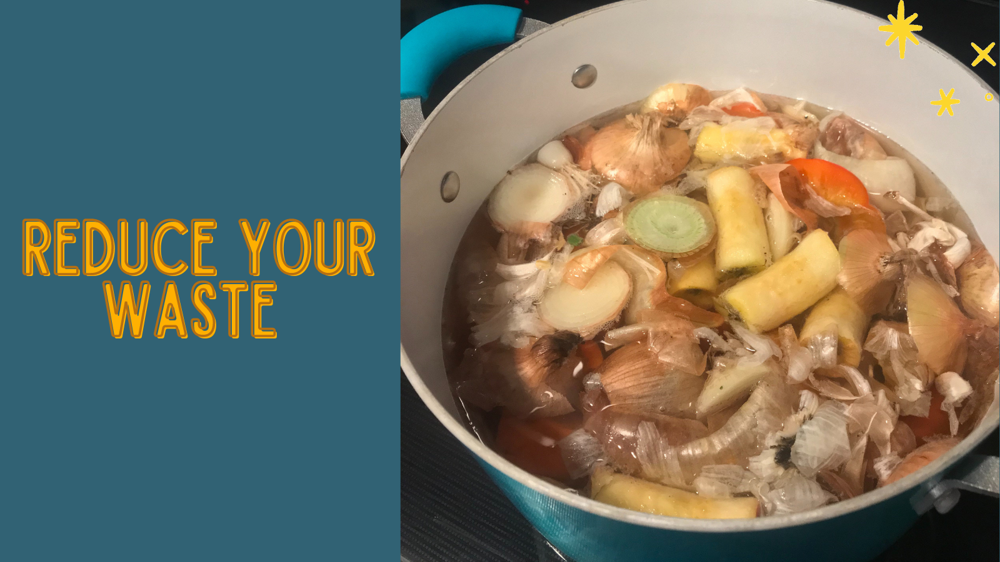

## Hello friends, Kyle and I wanted to share a little about reducing waste again!

### In the past when we have talked about reducing waste on our blog we focused on it in a wide and practical sense, but today we did something a little more specific that we thought was worth sharing. 

Today we needed a break from our computers so we decided to make a dessert with the extra two pears and 5 small apples that imperfect produce delivered to us. I looked up a recipe and let me just say it was so easy and delicious that Kyle and I are planning to make this a lot more often. 

[Here](https://simple-veganista.com/rustic-apple-pear-crisp/){target="_blank"} is the recipe that we followed from [Simple Veganista](https://simple-veganista.com/){target="_blank"}

Kyle and I also had some vegetable scraps that we froze and the container we were holding them in was full. So we decided to throw those along with the cores of the fruits we were making a crumble with into a pot to make home made vegetable broth. At first I questioned this but Kyle said "who is going to yell at us the broth police"? and he is right! There is no rules and you can experiment all you want.

It's super simple, all we did was **put the extra scraps in a pot and fill it with enough water to cover the vegetables (plus a little extra that will evaporate off) and add a tablespoon or two of salt. Bring it to a boil and then simmer for at least 4 hours.** Kyle and I usually don't even keep track of the time, we just plan to take this off the burner and strain it into a mason jar before we go to bed. 

We hope that by sharing things like this that we do, we can make sustainability seem a little more accessible and encourage others to try similar things. Let us know what you think down in the comments! :)