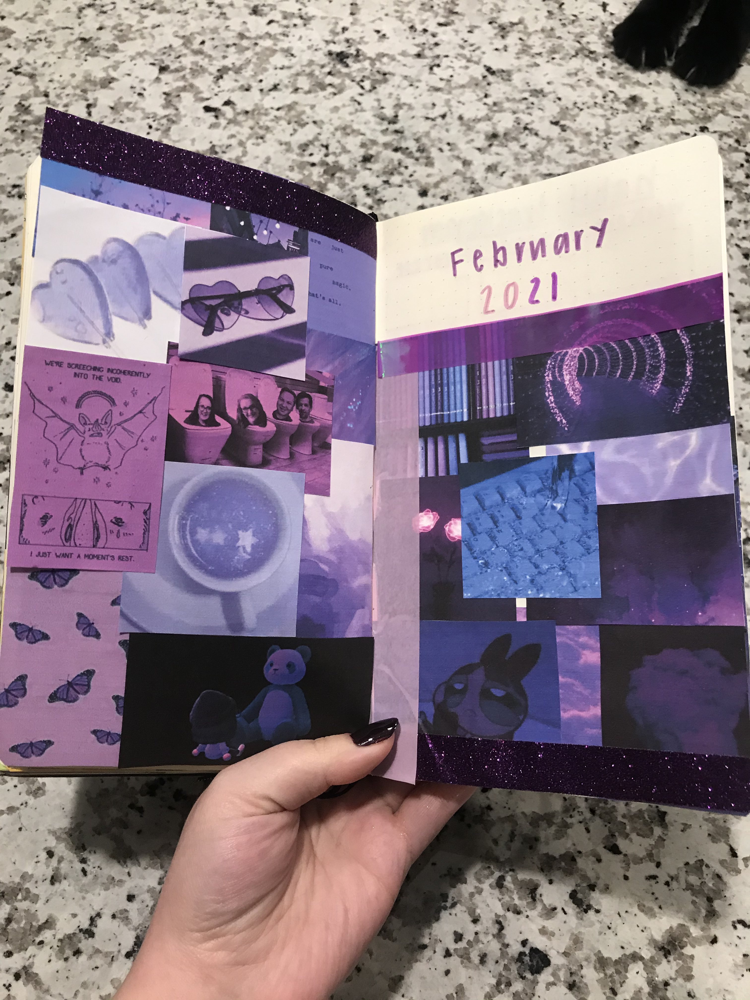
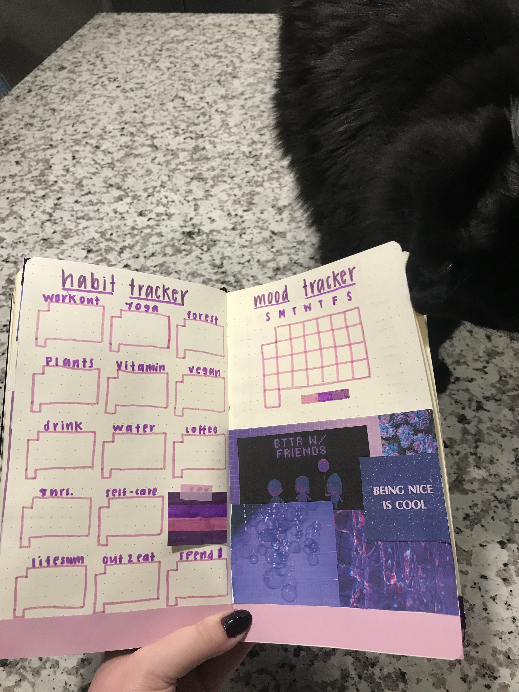
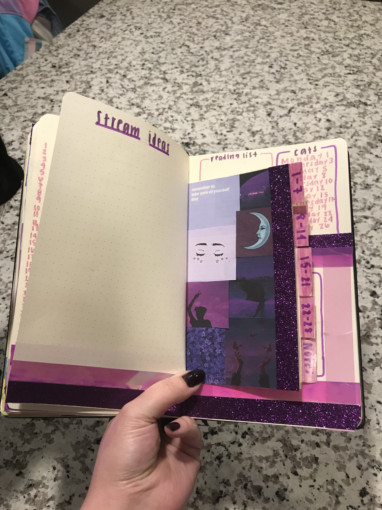
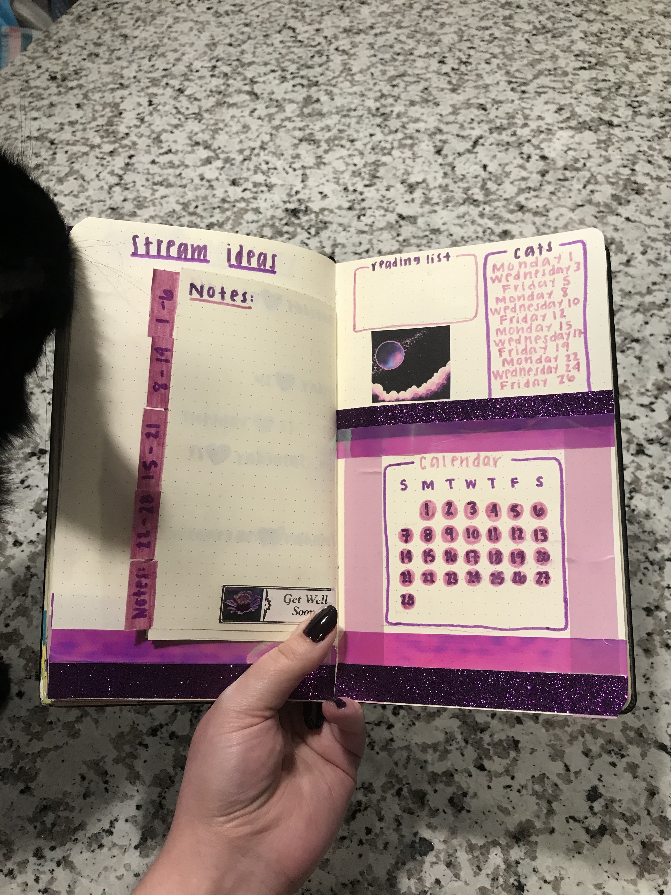

<!-- draft: true -->
<!-- Featured Image: 780x234 -->
<!-- Links: [](){target="_blank"} -->

<br>

## Hello friends, I completed my February 2021 bullet journal layout :)

On Saturday I showed the process of creating my bullet journal layout from start to finish. I asked the discord and my twitter followers which colors I should use this month and purple won so I did an all purple layout. If you are interested in the finished project there are pictures underneath the video! I will be doing this every month from now on so if you are interested **mark February 27th in your bullet journal because that is when I will be making the layout for March**. See you then (;

<br>

```{r, echo=FALSE}
blogdown::shortcode("youtube", "")
```

<br>

### Finished layout:




